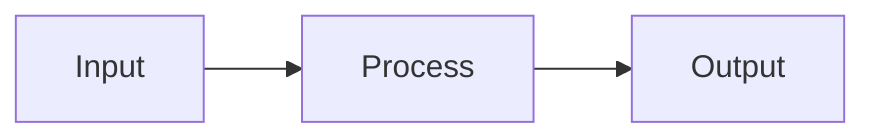

# ThreatFlux README Standards

Best practices for README files across ThreatFlux repositories. Every public repository should follow these standards to provide a consistent, professional, and scannable experience.

## Required Sections

Every README must include these sections in order:

1. **Header block** — centered title, badge row, one-line description, quick navigation links
2. **Table of contents** — linked section list for any README longer than one screen
3. **Features** — bulleted list of primary capabilities
4. **Installation / Quick Start** — copy-paste runnable commands
5. **Usage** — at least one working code example
6. **Contributing** — link to `CONTRIBUTING.md` with a short summary
7. **Security** — link to `SECURITY.md`
8. **License** — license name and link to `LICENSE`

## Badge Order

Place CI/status badges first (what users need most), then metadata badges:

```markdown
[](https://github.com/ThreatFlux/PROJECT/actions/workflows/ci.yml)
[](https://github.com/ThreatFlux/PROJECT/actions/workflows/security.yml)
[](https://crates.io/crates/PROJECT)
[](https://docs.rs/PROJECT)
[](LICENSE)
[](https://www.rust-lang.org)
```

Additional badges to consider:
- Codecov or Coveralls for coverage
- Codacy or Code Climate for code quality
- Docker image version for containerized projects
- GitHub release version

## Header Block

Use a centered `<div>` for the header to create visual hierarchy:

```markdown
<div align="center">

# Project Name

[

**One-line description of what this project does.**

[Quick Start](#quick-start) · [Docs](#) · [Contributing](CONTRIBUTING.md)

</div>
```

## Table of Contents

Include a linked TOC for any README over approximately 100 lines. Use a flat list of section links:

```markdown
## Table of Contents

- [Features](#features)
- [Installation](#installation)
- [Quick Start](#quick-start)
- [Usage](#usage)
- [Contributing](#contributing)
- [License](#license)
```

## Navigation Aids

Add back-to-top links after each major section in long READMEs:

```markdown
<p align="right"><a href="#table-of-contents">back to top</a></p>
```

## Diagrams

Use [Mermaid](https://mermaid.js.org/) for architecture and flow diagrams when the project has multiple components or a non-trivial pipeline. Mermaid renders natively on GitHub without external image hosting.

```markdown

```

For projects with a UI, include at least one screenshot or GIF demonstrating the primary workflow.

## Code Examples

- Every README must contain at least one runnable code example.
- Use fenced code blocks with language identifiers (`rust`, `bash`, `toml`).
- Prefer complete, copy-paste-ready examples over fragments.
- Test code examples in CI when possible (doc tests for Rust crates).

## Tables

Use tables for structured reference data: configuration options, environment variables, feature flags, CLI arguments, and workflow descriptions. Tables are more scannable than nested bullet lists for key-value data.

## Footer

End with a centered footer linking back to the org:

```markdown
---

<div align="center">

Built and maintained by [ThreatFlux](https://github.com/ThreatFlux)

</div>
```

## Anti-Patterns to Avoid

1. No runnable code examples
2. Missing license or license badge
3. No CI badge — readers cannot assess project health
4. Outdated Rust version in badges or docs
5. Missing installation section
6. Shipping unresolved template placeholders
7. Placeholder URLs (`yourusername`, `username/project`)
8. Stale roadmaps with past dates
9. README that describes a different project (copy-paste errors)
10. Long README with no table of contents or navigation aids
11. UI project with no screenshots
12. Excessive emojis that reduce professional tone

## Template Files

The following files are maintained in the [rust-cicd-template](https://github.com/ThreatFlux/rust-cicd-template):

| File | Purpose |
|------|---------|
| `README_TEMPLATE.md` | Starter README for generated projects |
| `CONTRIBUTING.md` | Contributing guide |
| `SECURITY.md` | Security policy |
| `LICENSE` | MIT license |
| `CODE_OF_CONDUCT.md` | Code of conduct |
| `docs/TEMPLATE_BOOTSTRAP_CHECKLIST.md` | Post-generation setup checklist |
| `docs/README_STANDARDS.md` | This document |
